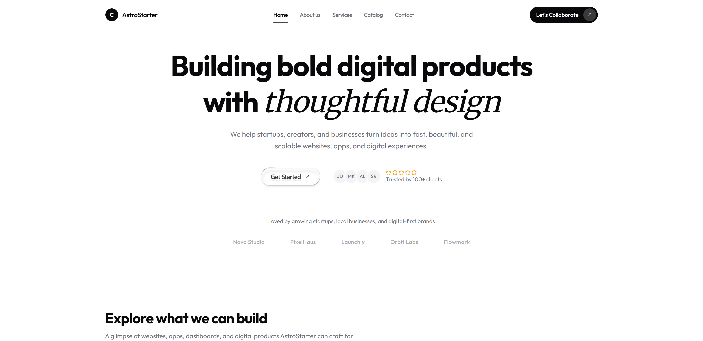
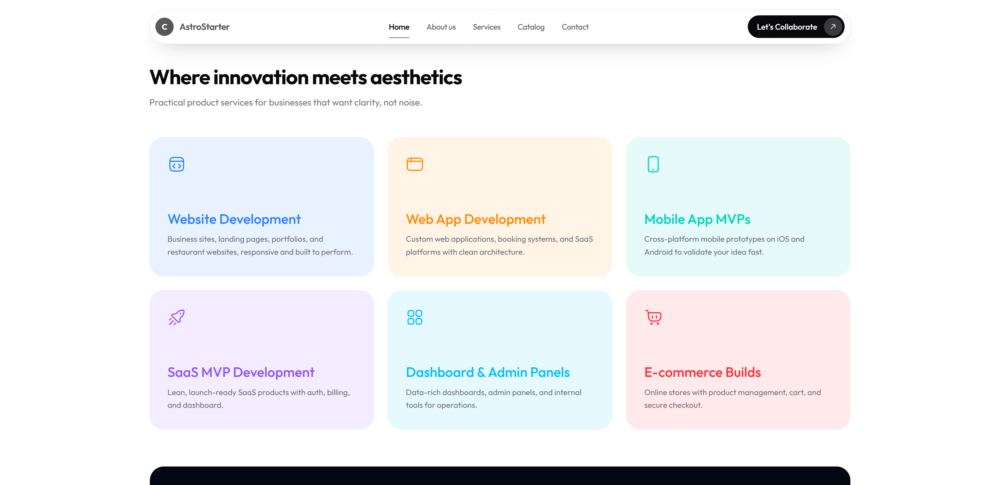
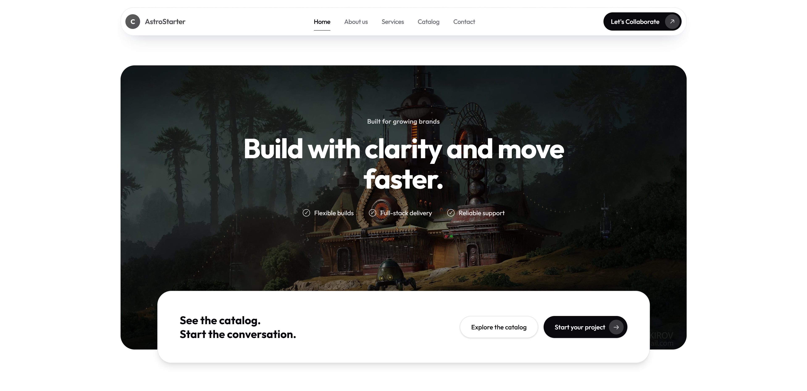
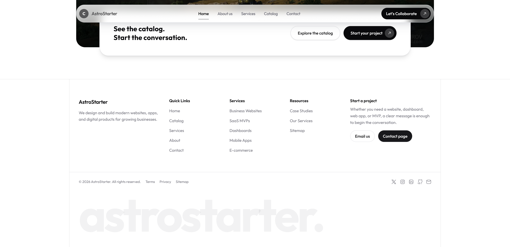

# AstroStarter

A clean, SEO-ready Astro starter for agency sites, product studios, and digital product launches.

**Live preview:** [https://astrostarter.astrostarter.workers.dev/](https://astrostarter.astrostarter.workers.dev/)

## Screenshots

| Home hero | Services grid |
| --- | --- |
|  |  |

| Landing page feature section | Footer and closing section |
| --- | --- |
|  |  |

## Project Overview

AstroStarter is an Astro marketing site and starter template built for showcasing agency services, a content-driven catalog, and clear calls to action.

It includes:

- A polished home page with hero, service highlights, catalog preview, and CTA sections
- Dedicated pages for about, services, catalog, contact, terms, privacy, sitemap, and 404
- A content collection for catalog entries so service/product pages stay structured
- SEO helpers including canonical, Open Graph, Twitter, JSON-LD, sitemap, and robots output
- Cloudflare Workers deployment support through the Astro Cloudflare adapter

## Tech Stack

- Astro
- TypeScript
- React
- Tailwind CSS 4
- Astro Content Collections
- Cloudflare Workers adapter
- `@astrojs/sitemap`
- ESLint
- Prettier
- Wrangler

## Project Structure

```txt
src/pages       - Route files and page-level content
src/components  - Reusable Astro components and sections
src/layouts     - Shared page layouts
src/content     - Content collections and markdown entries
src/lib         - Site config, navigation, and shared helpers
src/styles      - Global styles
public          - Static assets, screenshots, favicon, and OG image assets
scripts         - Utility scripts such as route smoke checks
```

Key files:

- [`src/lib/site.ts`](./src/lib/site.ts) - site metadata, navigation, shared copy, and social links
- [`src/content.config.ts`](./src/content.config.ts) - content collection schema for catalog entries
- [`astro.config.mjs`](./astro.config.mjs) - Astro integration and Cloudflare adapter config
- [`wrangler.jsonc`](./wrangler.jsonc) - Cloudflare Workers deployment settings

## Development Commands

This project uses `pnpm` because `pnpm-lock.yaml` is present.

```bash
pnpm install
pnpm dev
pnpm build
pnpm preview
pnpm lint
pnpm format
pnpm typecheck
pnpm smoke
pnpm verify
pnpm deploy
pnpm generate-types
```

What the main commands do:

- `pnpm dev` starts the local Astro development server
- `pnpm build` creates the production build
- `pnpm preview` builds and runs the Cloudflare preview flow through Wrangler
- `pnpm lint` runs ESLint
- `pnpm format` formats Astro, TypeScript, and TSX files with Prettier
- `pnpm typecheck` runs Astro type checking
- `pnpm smoke` checks built routes and generated assets
- `pnpm verify` runs lint, typecheck, build, and smoke checks together
- `pnpm deploy` builds and deploys to Cloudflare

## Astro-Specific Guidelines

- Prefer `.astro` components for static UI.
- Use framework components only when interactivity is required.
- Avoid unnecessary client-side JavaScript.
- Use Astro islands intentionally and keep hydration limited.
- Use `client:load`, `client:idle`, `client:visible`, or `client:only` only when the interaction truly needs it.
- Keep pages lightweight and mostly static when possible.
- Use `Astro.props` clearly and keep frontmatter readable.
- Prefer Astro Content Collections for structured content like catalog or case-study entries.
- Avoid adding heavy dependencies unless they solve a real need.

## Component Guidelines

- Keep components small and focused.
- Reuse existing components before creating new ones.
- Follow the current naming and folder structure.
- Type props when TypeScript is used.
- Keep business logic out of presentation components when possible.
- Separate layout components from feature sections.
- Preserve the current design patterns and spacing rhythm.

## Styling Guidelines

This project uses Tailwind CSS 4 with a small amount of global styling.

- Prefer existing utility patterns and shared tokens.
- Avoid one-off values unless there is a clear design reason.
- Keep class names readable and consistent.
- Extract repeated UI into components instead of duplicating long class lists.
- Keep global CSS limited to broad baseline styles and theme-level rules.

## UI/UX Guidelines

- Keep the interface clean, modern, and consistent with the current marketing-site style.
- Prioritize readability, spacing, and clear hierarchy.
- Make all pages responsive.
- Design mobile-first where possible.
- Avoid unnecessary animations.
- Use subtle transitions only when they improve the experience.
- Keep colors, borders, shadows, and radius consistent with the existing design.

## SEO Guidelines

- Give every important page a unique title and description.
- Use semantic HTML.
- Use one clear `h1` per page.
- Add Open Graph and Twitter metadata where relevant.
- Use canonical URLs where appropriate.
- Keep sitemap and robots output correct.
- Use descriptive alt text for images.
- Avoid duplicate or thin pages.
- Prefer static generation for SEO-heavy content when possible.

## Performance Guidelines

- Keep JavaScript minimal.
- Do not hydrate components unnecessarily.
- Optimize images where possible.
- Use responsive images for large visual assets.
- Avoid large, unoptimized background images.
- Lazy-load non-critical assets.
- Avoid large libraries for small tasks.
- Keep CSS lean.
- Make sure pages stay fast on mobile networks.

## Accessibility Guidelines

- Use semantic HTML.
- Buttons must be buttons, links must be links.
- Add accessible labels where needed.
- Maintain keyboard navigation.
- Keep color contrast readable.
- Do not remove focus states.
- Add meaningful alt text for images.
- Avoid interaction patterns that only work with a mouse.

## Content Guidelines

This project uses a structured catalog collection.

- Follow the existing markdown and frontmatter shape in `src/content/catalog`.
- Keep slugs and filenames clear and stable.
- Preserve headings and metadata patterns.
- Avoid changing published URLs unless the task requires it.
- Keep frontmatter consistent across entries.

## Code Quality Rules

- Make small, focused changes.
- Do not rewrite unrelated files.
- Do not introduce unnecessary abstractions.
- Do not change public APIs without a good reason.
- Preserve existing behavior unless the task asks otherwise.
- Keep code readable over clever.
- Remove unused imports and dead code.
- Follow the existing formatting rules.
- Run the available checks before finishing.

## Git and File Safety

- Do not delete files unless clearly required.
- Do not rename routes casually because it can break URLs.
- Do not overwrite user content.
- Do not modify environment files unless explicitly asked.
- Do not commit secrets.
- Do not expose API keys or private tokens.
- Keep changes limited to the requested scope.

## Environment Variables

No `.env` file is committed in this repository.

- Do not add new environment variables unless they are needed.
- Never place real secrets in documentation.
- If you introduce env vars, document placeholder values only and note where they are used.

## Testing and Validation

Before finishing changes, validate the project with the available checks:

- Run `pnpm typecheck`
- Run `pnpm lint`
- Run `pnpm build`
- Run `pnpm smoke` when route or asset changes may affect the built output
- Manually inspect updated pages in the browser
- Check responsive behavior on desktop and mobile widths
- Confirm there are no console errors
- Confirm SEO metadata for page-level changes
- Confirm no unnecessary client-side JavaScript was added

## Agent Behavior

- Start by understanding the existing codebase and follow the current patterns.
- Prefer minimal, correct changes over broad refactors.
- Ask for clarification only when truly blocked.
- Make reasonable assumptions for small, low-risk tasks.
- Explain important changes after editing.
- Mention any checks that could not be run.

## License

MIT. See [LICENSE](./LICENSE) for the full text.
